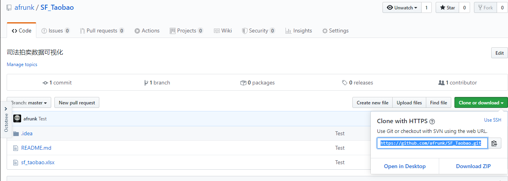

# SF_Taobao
司法拍卖数据可视化

## 如何使用 Git 辅助开发
首先，我在 Github 上创建了一个仓库,获取一个 Git 的仓库路径，然后在本地的开发环境使用 Git Bash 执行如下指令，同步我们的代码和文件到 Github 上。



```python
git init # 创建一个本地 git 文件
git add . # 将本地的改动添加到待同步步骤
git remote add origin '上面创建的仓库路径' 
# $ git remote add origin 'https://github.com/afrunk/SF_Taobao.git'
git commit -m 'Test' # 更新注释为 Test
git push -u origin master -f 
# 第一次的更新的分支为 master 必须加 -f 否则报错 第一次执行命令需要后续不需要
git push origin master 
# 更新内容的固定格式
```

这样子，我们就将在本地开发的项目都同步到 Github 仓库了，只需要在服务器上的 Pycharm 使用 Clone 该仓库，就可以直接运行项目了。避免在服务器上开发的效率低下问题，实现了 本地开发环境——远程开发环境的内容同步。